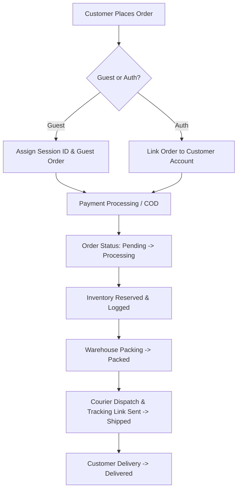

# 🌿 Prakruti — Business & Platform Complete Documentation

> **Tagline**: *Pure by Nature. Honest by Choice.*  
> **Founded**: 2021  
> **Headquarters & Sourcing**: Verified organic farm cooperatives across India (Gujarat, Rajasthan, Tamil Nadu, Jammu, Karnataka)  
> **Customer Base**: 10,000+ health-conscious families across India  
> **Certifications**: USDA Organic, Jaivik Bharat (FSSAI), ISO 22000 Certified Processing, NABL Accredited Lab Testing  

---

## 📑 Table of Contents
1. [Executive Summary & Brand Philosophy](#1-executive-summary--brand-philosophy)
2. [Core Products & Category Breakdown](#2-core-products--category-breakdown)
3. [Key Differentiators & Quality Standard](#3-key-differentiators--quality-standard)
4. [Unique Digital Features & Customer Experience](#4-unique-digital-features--customer-experience)
5. [Frontend Architecture & Design System](#5-frontend-architecture--design-system)
6. [Backend Infrastructure, API & Admin Panel](#6-backend-infrastructure-api--admin-panel)
7. [Operational & Fulfillment Workflows](#7-operational--fulfillment-workflows)
8. [WooCommerce & Multi-Channel Synchronization](#8-woocommerce--multi-channel-synchronization)

---

## 1. 🌿 Executive Summary & Brand Philosophy

### 1.1 Brand Story
Prakruti was born out of a mission to bring genuine, unprocessed, chemical-free nutrition directly from Indian organic farms to kitchen tables. What started in 2021 as a specialized farm-sourcing initiative for traditional **A2 Bilona Ghee** and cold-pressed oils has evolved into a full-scale direct-to-consumer (D2C) organic staples brand.

### 1.2 Mission & Vision
* **Mission**: To make 100% natural, unadulterated, and nutrient-dense daily grocery staples accessible and transparent for modern households while empowering local, chemical-free farmers with fair trade prices.
* **Vision**: To become India's most trusted household brand for native organic nutrition, driving a national transition toward preventive wellness and regenerative agriculture.

### 1.3 Target Audience
* Health-conscious families seeking chemical-free daily groceries.
* Fitness and wellness enthusiasts tracking nutrition, macro-balance, and gut health.
* Parents seeking unadulterated first-harvest food for infants and growing children.
* Individuals managing lifestyle conditions (diabetes, cholesterol, gluten sensitivities) looking for native millets and low-GI grains.

---

## 2. 🌾 Core Products & Category Breakdown

Prakruti organizes its catalog into 7 core wellness categories with over 40+ carefully curated SKUs:

| Category | Description & Highlights | Key Product Examples |
| :--- | :--- | :--- |
| **Cereal & Pulses** | 100% unpolished dals retaining natural fiber and plant proteins. Zero artificial coloring or chemical polish. | Masoor Dal Split, Panchratna Mix Dal, Rajma Jammu, Organic Chana Dal, Toor Dal, Moong Whole |
| **Healthy Seeds** | Nutrient-dense raw seeds rich in Omega-3 fatty acids, zinc, and dietary fiber. | Raw Chia Seeds, Roasted Flax Seeds, Pumpkin Seeds, Sunflower Seeds, Watermelon Seeds |
| **Indian Spices** | First-crop, single-origin aromatic whole and ground spices with high natural essential oil content. | Salem Curcumin Turmeric Powder, Whole Cumin (Jeera), Coriander Powder, Tellicherry Black Pepper, Cardamom |
| **Millets** | Ancient climate-resilient grains naturally gluten-free and low-glycemic. | Foxtail Millet, Ragi (Finger Millet), Pearl Millet (Bajra), Kodo Millet, Little Millet |
| **Oils & Ghee** | Cold-pressed wood-churned oils (Kachi Ghani) and traditional Vedic Bilona A2 Gir Cow Ghee. | A2 Gir Cow Vedic Ghee, Cold-Pressed Groundnut Oil, Mustard Oil, Virgin Sesame Oil, Coconut Oil |
| **Rice & Flours** | Stone-ground whole flours and heritage unpolished rice varieties. | Traditional Aged Basmati Rice, Sona Masoori, Khapli (Emmer) Wheat Atta, Multigrain Atta, Jowar Atta |
| **Natural Sweeteners** | Unrefined, chemical-free sweetening alternatives without sulfur bleaching. | Organic Jaggery Powder, Vedic Bilona Desi Khand, Raw Khandasari Sugar |

---

## 3. 🛡️ Key Differentiators & Quality Standard

1. **100% Unpolished & Whole Grain**: Unlike commercial brands that use marble powder or synthetic oils to polish dals, Prakruti retains the native nutrient-dense bran and germ layer.
2. **Wood-Pressed & Vedic Churning**: Cold-pressed oils extracted below 40°C in traditional wood expellers; Ghee made from curd of grass-fed A2 Gir cows using the authentic *Bilona* two-way churning method.
3. **15-Point Lab Verified Testing**: Every harvest batch is screened by NABL-accredited laboratories for zero pesticide residue, heavy metal clearance, and aflatoxin absence.
4. **Hygienic Multi-Layer Packaging**: Eco-conscious, food-grade vacuum-sealed and zipper-pouch packaging prevents moisture degradation and preserves natural aromas.

---

## 4. 💡 Unique Digital Features & Customer Experience

### 4.1 📦 Algorithmic Family Monthly Pack Builder
An interactive monthly grocery calculator located at `#family-pack`:
* Allows customers to specify household members (Adults, Children, Seniors).
* Automatically calculates recommended monthly kilograms for staples (Atta, Rice, Dal, Ghee, Oils, Spices, Seeds).
* Dynamically calculates family caloric and protein requirements.
* Provides instant one-click bundle creation with custom multi-item discounts.

### 4.2 🩺 Health & Nutrition Education Hub (`#education`)
* **Interactive BMI & Nutritional Screener**: Supports both Metric (cm/kg) and Imperial (ft-in/lbs) units with pediatric guidance and customized organic grocery recommendations.
* **Organic vs. Conventional Comparison Matrix**: Explains soil biodiversity, pest management, and unpolished processing benefits.
* **Direct Consultation Booking**: Form to schedule one-on-one sessions with certified Ayurvedic lifestyle consultants.

### 4.3 🖼️ Farm Gallery & Traceability (`#farm-gallery`)
* High-definition visual photo gallery showcasing origin farms, sustainable rainwater harvesting, traditional Gaushalas, and crop harvesting.

### 4.4 🛒 Comprehensive E-Commerce Flow
* Guest cart sessions persisted with unique browser `X-Session-ID` tokens.
* Seamless user account upgrade: Guest carts automatically merge upon login/registration.
* Detailed customer portal (`#account`): Saved addresses, past order history with tracking statuses (`pending`, `processing`, `packed`, `shipped`, `delivered`), invoice generation, and return/replacement requests.

---

## 5. 💻 Frontend Architecture & Design System

* **Location**: `ecoomerce prakruti/`
* **Core Technologies**: React 18, Vite 5, Framer Motion, React Icons.
* **Styling Approach**: Custom Vanilla CSS design tokens (`index.css`, `App.css`) with responsive mobile-first typography and earthy wellness color palettes:
  * Primary Green: `#205634` (Deep Forest Organic Green)
  * Secondary Green: `#2E7D32` / Accent Gold: `#D4AF37`
  * Warm Cream Background: `#FBF8F2` / Surface: `#FFFFFF`
* **Navigation Architecture**: Smooth hash-based and state-managed SPA routing (`#home`, `#categories`, `#product-:id`, `#cart`, `#account`, `#education`, `#family-pack`, `#farm-gallery`, `#about`, `#contact`).
* **Resilient API Client (`src/api/client.js`)**: Handles JWT/Sanctum bearer tokens, session storage fallbacks, automatic retry, and graceful mock data fallback if backend is offline.

---

## 6. ⚙️ Backend Infrastructure, API & Admin Panel

* **Location**: `ecommerce-backend-new/ecommerce-backend-new/`
* **Framework**: Laravel 13.x with PHP 8.3+.
* **Database**: MySQL 8.0+ / SQLite with 30+ relational Eloquent models:
  * `Product`, `ProductVariation`, `Category`, `Brand`, `ProductAttribute`, `VariationAttributeValue`
  * `Cart`, `CartItem`, `Order`, `OrderItem`, `OrderStatusHistory`, `Payment`, `Refund`, `ShippingMethod`, `Tax`
  * `User`, `Role`, `Permission`, `PersonalAccessToken`, `ActivityLog`, `InventoryLog`, `InventoryTransaction`
  * `FamilyPack`, `Inquiry`, `ConsultationRequest`, `Banner`, `Page`, `Setting`

### 6.1 Public & Customer REST API (`/api/v1`)
* `GET /api/v1/products` & `GET /api/v1/products/{slug}`: Product catalog with category, price, and attribute filters.
* `GET /api/v1/categories`: Category hierarchy and counts.
* `GET|POST|PUT|DELETE /api/v1/cart`: Session-aware and user-authenticated cart operations.
* `POST /api/v1/checkout` & `POST /api/v1/orders`: Order placement, tax calculation, and shipping fee computation.
* `POST /api/v1/register` & `POST /api/v1/login`: Rate-limited authentication issuing Sanctum API tokens.
* `GET|PUT /api/v1/me`: Customer profile, order history, and address book management.
* `POST /api/v1/inquiries` & `POST /api/v1/consultation-requests`: Customer support and lead capture.

### 6.2 Admin Portal (`/admin`)
* **Role-Based Access Control (RBAC)**: Super Admin and Admin permissions.
* **Catalog Management**: Product CRUD, variant matrix generator, bulk upload, CSV import, status toggles.
* **Order Management**: Multi-state fulfillment workflow (`pending -> processing -> packed -> shipped -> delivered`), payment verification, and printable invoices.
* **Inventory Control**: Real-time stock reservation logs preventing negative stock anomalies.
* **Business Analytics & Reporting**: Sales revenue, profit margin, GST/HSN tax breakdowns, customer metrics, and CSV export.
* **System Operations**: Health monitoring (`/admin/system-health`), failed queue recovery, and database backup generator.

---

## 7. 🚚 Operational & Fulfillment Workflows

---

## 8. 🔄 WooCommerce & Multi-Channel Synchronization

* **Bidirectional Integration**: Syncs catalog, stock levels, and customer orders with external WooCommerce stores.
* **Idempotency & Safety**: Webhook signature verification and idempotency keys to eliminate double-order entry or stock mismatch.
* **Asynchronous Queue Jobs**: Background worker processes heavy syncs and report generations without slowing storefront responsiveness.

---
*Document generated for Prakruti E-Commerce Platform — Updated September 2026.*